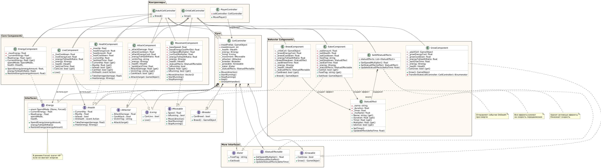

# Moneulo

Это проект 2D симуляции/игры, которая по своей сути напоминает этап клетки в игре Spore

# Основная суть

На процедурно генерируемой карте спавнятся определённое количество плотоядных молекул под управлением модели многослойного перцептрона

**Травоядные** клетки едят _растения_
**Плотоядные** клетки едят _мясо_

Задача обоих видов - _**размножаться**_

# Реализованные механики
* Процедурная генерация карты (стен (генерация сделана так, чтобы они не пересекались), растений для еды (растения спавнятся дополнительно раз в 3 минуты))
* Механика клеток:
  * Они имеют очки здоровья и энергии
  * Они имеют сопсобности, которые могу тиспользовать очки здоровья, если нет очков энергии:
    * Live () (тратит очки энергии со временем по факту существования)
    * Breed () (размножиться, доступно только для взрослой клетки)
    * Grow () (вырасти, жостпуно только для клетки-ребёнка)
    * Move () (двигаться, стоимость по энергии прямо пропорционально пройденному расстоянию)
    * Attack () (атаковать)
  * И способности, которые могут быть использованы только за энергию:
    * Eat () (есть)
    * Heal () (регенерировать)
  * Реализованы временные статус-эффекты замедления после Eat () и Breed ()
  * Реализованы PlayerController для тестирования и управления клеткой через открытый в CellController интерфейсе (_данный интерфейс будет использован позднее нейросетью для самостоятельного управления клеткой_)
  * Реализована механика размножения, т.е. Breed () спавнит новую клетку-ребёнка с урезанными характеристиками, и спустя время она может вырасти во взрослую клетку, которая затем может опять размножиться
  * Реализованы префабы с разными настройками состояния у плотоядных/травоядных и их взрослых/новорождённых особей

# Важные особенности

Автор старался использовать принципы чистого кода SOLID и добрые и вечные техники ООП, поэтому основной упор был сделан на хороший дизайн - способности клеток реализованы как интерфейсы и реализующие их компоненты, которые потом внедряются в базовый абстрактный класс клетки с помощью композиции

### UML диаграмма:

 
# Что ожидается
* Механика области видимости - каждая клетка видит объекты только в ограниченной области
* Механика сигналов - если клетка видит жертву или хищника, то подаёт сигнал. Если клетка видит своего сородича, который подал сигнал, то подаёт сигнал (_эта механика необохдима для того, чтобы обучающейся нейросети дать особенность, которая позволит моделировать сообщность реальных животных в замкнутой системе_)
* Затеняющий шейдер для визуализации области видимости игрока
* Разработка MLP (Multi Layer Perceptron) модели
* Внедрение и обучение модели многослойного перцептрона
