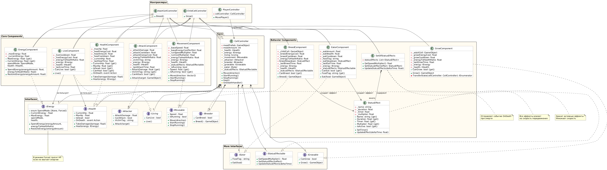

# Language [ENG](#moneulo)/[RUS](#монеуло)

# Moneulo

This is a 2D simulation/game project that is essentially similar to the cell stage in Spore.

# Technologies used
* Unity Editor v6000.2.11f1
* Vim 9.1 with dependencies:
  * OmniSharp LSP server
  * Unity tool [kotpodlawkoy sln generator] (https://github.com/kotpodlawkoy/kotpodlawkoy.sln.csproj.generator)

# Main idea

A certain number of carnivorous molecules spawn on a procedurally generated map under the control of a multilayer perceptron model.

**Herbivorous** cells eat _plants_  
**Carnivorous** cells eat _meat_

The goal of both types is to _**reproduce**_

# Implemented mechanics
* Procedural map generation (walls (generated so that they do not intersect), plants for food (plants spawn additionally every 3 minutes))
* Cell mechanics:
  * They have health and energy points
  * They have abilities that can use health points if there are no energy points:
    * Live () (spends energy points over time based on existence)
    * Breed () (reproduce, only available to adult cells)
    * Grow () (grow, strictly for child cells)
    * Move () (move, energy cost is directly proportional to the distance traveled)
    * Attack () (attack)
* And abilities that can only be used for energy:
    * Eat () (eat)
    * Heal () (regenerate)
  * Temporary slowdown status effects after Eat () and Breed () have been implemented
  * PlayerController has been implemented for testing and controlling the cell via the interface opened in CellController (_this interface will later be used by the neural network for independent cell control_)
  * Reproduction mechanics implemented, i.e. Breed () spawns a new baby cell with reduced characteristics, and after a while it can grow into an adult cell, which can then reproduce again
  * Prefabs with different state settings for carnivores/herbivores and their adult/newborn individuals have been implemented.

# Important features

The author tried to use SOLID clean code principles and good, timeless OOP techniques, so the main focus was on good design — cell capabilities are implemented as interfaces and components that implement them, which are then integrated into the base abstract cell class using composition.

### UML diagram:

 
# What to expect
* Field of view mechanics—each cell can only see objects within a limited area
* Signal mechanics - if a cell sees a prey or predator, it sends a signal. If a cell sees one of its own kind that has sent a signal, it sends a signal (_this mechanic is necessary in order to give the learning neural network a feature that will allow it to simulate the community of real animals in a closed system_)
* Shading shader for visualizing the player's field of view
* Development of an MLP (Multi Layer Perceptron) model
* Implementation and training of a multilayer perceptron model

# Монеуло

Это проект 2D симуляции/игры, которая по своей сути напоминает этап клетки в игре Spore

# Использованные технологии
* Unity Editor v6000.2.11f1
* Vim 9.1 с зависимостями:
  * OmniSharp LSP server
  * Unity tool [kotpodlawkoy sln generator](https://github.com/kotpodlawkoy/kotpodlawkoy.sln.csproj.generator)

# Основная суть

На процедурно генерируемой карте спавнятся определённое количество плотоядных молекул под управлением модели многослойного перцептрона

**Травоядные** клетки едят _растения_  
**Плотоядные** клетки едят _мясо_

Задача обоих видов - _**размножаться**_

# Реализованные механики
* Процедурная генерация карты (стен (генерация сделана так, чтобы они не пересекались), растений для еды (растения спавнятся дополнительно раз в 3 минуты))
* Механика клеток:
  * Они имеют очки здоровья и энергии
  * Они имеют сопсобности, которые могу тиспользовать очки здоровья, если нет очков энергии:
    * Live () (тратит очки энергии со временем по факту существования)
    * Breed () (размножиться, доступно только для взрослой клетки)
    * Grow () (вырасти, жостпуно только для клетки-ребёнка)
    * Move () (двигаться, стоимость по энергии прямо пропорционально пройденному расстоянию)
    * Attack () (атаковать)
  * И способности, которые могут быть использованы только за энергию:
    * Eat () (есть)
    * Heal () (регенерировать)
  * Реализованы временные статус-эффекты замедления после Eat () и Breed ()
  * Реализованы PlayerController для тестирования и управления клеткой через открытый в CellController интерфейсе (_данный интерфейс будет использован позднее нейросетью для самостоятельного управления клеткой_)
  * Реализована механика размножения, т.е. Breed () спавнит новую клетку-ребёнка с урезанными характеристиками, и спустя время она может вырасти во взрослую клетку, которая затем может опять размножиться
  * Реализованы префабы с разными настройками состояния у плотоядных/травоядных и их взрослых/новорождённых особей

# Важные особенности

Автор старался использовать принципы чистого кода SOLID и добрые и вечные техники ООП, поэтому основной упор был сделан на хороший дизайн - способности клеток реализованы как интерфейсы и реализующие их компоненты, которые потом внедряются в базовый абстрактный класс клетки с помощью композиции

### UML диаграмма:

 
# Что ожидается
* Механика области видимости - каждая клетка видит объекты только в ограниченной области
* Механика сигналов - если клетка видит жертву или хищника, то подаёт сигнал. Если клетка видит своего сородича, который подал сигнал, то подаёт сигнал (_эта механика необохдима для того, чтобы обучающейся нейросети дать особенность, которая позволит моделировать сообщность реальных животных в замкнутой системе_)
* Затеняющий шейдер для визуализации области видимости игрока
* Разработка MLP (Multi Layer Perceptron) модели
* Внедрение и обучение модели многослойного перцептрона
